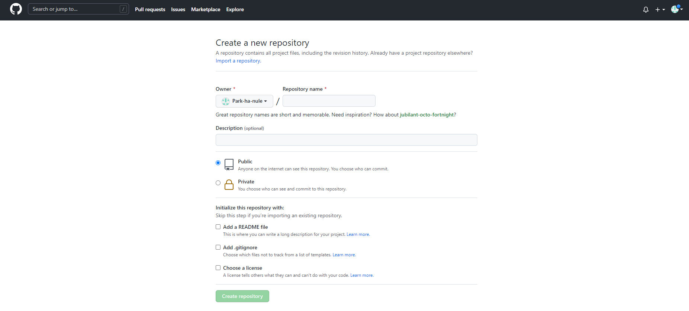
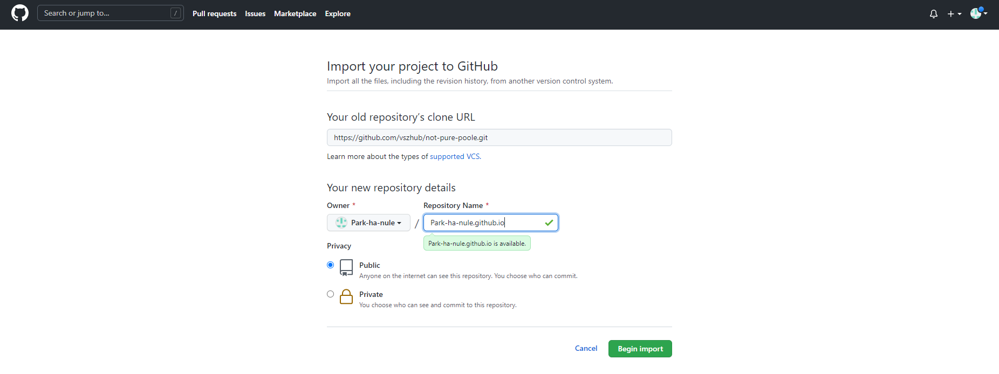
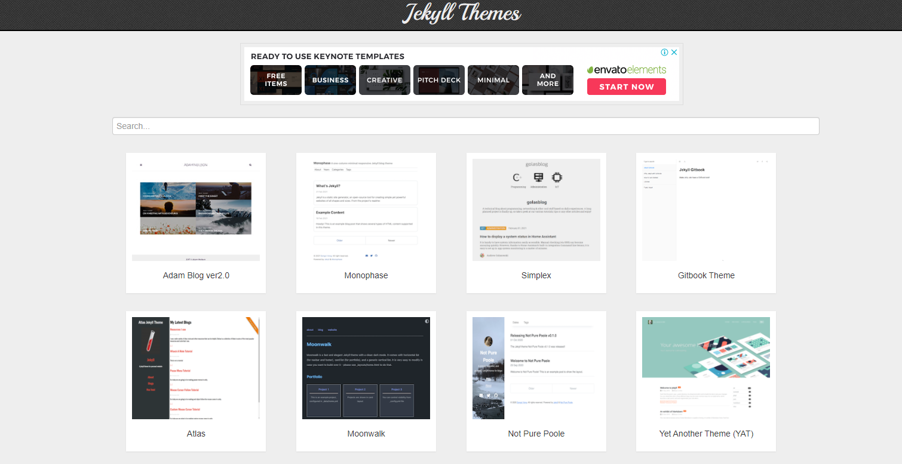
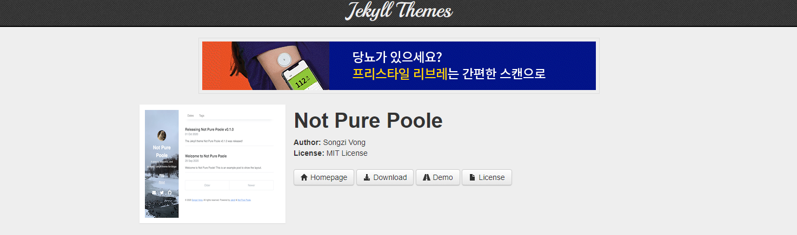
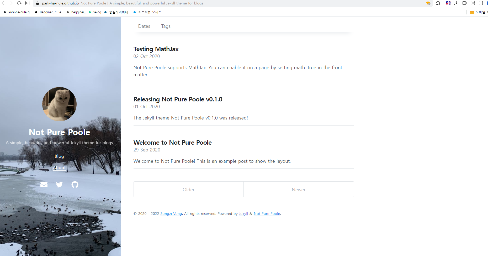

---

기존에 git blog가 있었으나, 거의 사용하지 않기도 하고 하나 새로 만들고 싶어서 처음부터 진행해보려고 한다. github로 블로그를 생성하려는 사람들에게 도움이 되길 바란다.

1. Repository 생성하기

    GitHub Blog를 생성하려면 Github에 Repository를 생성해야 한다.

    

    우측의 new를 클릭해서 새로운 repository 생성 페이지로 이동한다.

    

    여기서 주의할 점은 import a repository를 눌러야한다.

    

    위의 화면이 나와야한다.

    - 위 화면에서 clone url은 jekyll에서 테마를 선택하여 해당 url을 넣어야한다.
2. Jekyll 테마 선택

    [Jekyll 테마 링크]([http://jekyllthemes.org/](http://jekyllthemes.org/))

    

    

    테마 선택 후 Homepage 버튼을 클릭하여 해당 github 주소로 이동 후 해당하는 github 주소를 clone 한다.

    

    clone한 주소를 clone url에 넣어준다.

    <aside>
    💡 여기서 주의할 점은, repository명운 꼭 [GitHubID].github.io로 설정해야한다는 점이다.

    </aside>

    그리고 Begin import 버튼을 클릭하고 조금 기다리면 선택한 블로그 테마를 import한 Repository가 생성된다.

3. 블로그 접속 확인

    위에서 설정한 Repository명으로 접속 테스트를 진행하면 된다.

    

    Repository명으로 설정한 Park-ha-nule.github.io로 접속한 화면이다.

4. Repository 가져오기

    이제 실제로 수정하고 배포할 수 있도록 내 컴퓨터 (local)에 Repository를 가져온다.

    ```bash
    // 블로그 clone할 경로로 이동
    $ git clone {새로 생성한 repository 주소 clone}
    // 블로그 수정 후 test 진행. 아무 posts에 들어가서 내용 수정
    $ git add . // 수정한 내용 올리기
    $ git commit -m "commit message" // commit message 작성
    $ git remote -v // remote 확인
    $ git push origin master // commit 내용 push
    ```

5. 본인이 원하는대로 수정하고 git push 하면 완료!


[참고사이트]([https://www.zoomkoding.com/gatsby-github-blog/](https://www.zoomkoding.com/gatsby-github-blog/))
